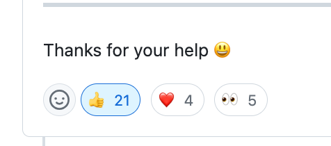

# Welcome to A-gebahyo contributing guide <!-- omit in toc -->

**A-gebahyo** こと「上馬評」の開発に関心をお寄せいただき、誠にありがとうございます :sparkles:

皆様にはフロントエンド、特に**React component を通じたデータの可視化のアプローチ**についてお力添えいただきたいと考えています

## New contributor guide

[上馬評: A-gebahyo](https://github.com/Ningensei848/A-gebahyo#readme) プロジェクトについて全容を知りたい方は、まず [README](https://github.com/Ningensei848/A-gebahyo#readme) をお読みください

そもそも<u>どうやって貢献できるのか知りたい方</u>は[こちら](types-of-contributions.md)をご確認ください

## Getting started

自分で実際に手を動かしてみたいという方は、以下に示すいくつかのコマンドを実行してください：

```shell
cd ${YOUR_DEV_DIR}
git clone --depth=1 https://github.com/Ningensei848/A-gebahyo.git
npm install
npm run start
```

`npm run start` を実行すると、ローカルサーバが稼働して http://localhost:3333 にアクセルできるようになります

## How to contribute

Issue に関して、二つの貢献方法があります：

1. issue を提起する
2. ↑ を解決する

### 1. Create a new issue

もしなんらかの問題に遭遇してしまったら、一旦落ち着いてください。


冷静さを取り戻したところで、**その問題が issue として既に報告されていないか調べる**ことから始めましょう。該当する issue の有無を確認するためにキーワードで検索してください。

関連 issue が未だ存在しなかった場合には、[issue フォーム](https://github.com/Ningensei848/A-gebahyo/issues/new)を使用して新しい issue を提起することができます。

### 2. Solve an issue

既存の issue は誰かが直面している未解決なままの問題です…… :cry:
もしあなたが issue の解決に貢献したいと考えているなら、ぜひ [issue の一覧](https://github.com/Ningensei848/A-gebahyo/issues)から取り組みたいと思えるものを探してみてください。

#### Add a stamp to indicate agreement

もしあなたがまだまだ道を進み始めたばかりのアマチュアであれば、いざ興味関心のある issue は見つけても、自分がやれることは何もないと嘆いているかもしれません。

そんなときもあなたにできることは残されています！
すなわち、「Issue 作成者へのリアクション」を示すことができます。

このおかげで、スタンプが多いほどたくさんの関係者から注目されている issue であると視覚的にわかりやすくなります
（し、優先度を高く開発を進めようという意思決定に繋がりやすくなります）。



#### Identify the details of the issue

Issue を作成するとき、どうしても分かりにくくなってしまうことが大いにあります。
第三者からみて理解を得られにくい issue は、誰からも触れられずそのまま風化していまいがちです。

そこで、わかりにくい issue に対しては積極的にフィードバックコメントを残していただきたいと考えています。
誰かから指摘されることで初めて気付けることもありますし、自己解決につながるかもしれません。


問答によって問題がブラッシュアップされることで、開発者たちにとっては何が問題なのかより明確に認識できるようになります。
すなわち、あなたの何気ない問いかけが開発のスピードアップに繋がっていくと言えるのです！
（何卒奮ってご参加ください！）

#### Create PR that solves the issue

解決すべき issue の優先順位やその具体的な内容が分かれば、後は手を動かしてその問題を解決するだけです。

A-gebahyo では、未だ具体的な PR の作法等は策定していません。
興味関心を持ってくれた皆さまが各々のやり方で PR を出してくだされば、それをレビューし、内容に問題がなければマージしていくこととする予定です。

皆様からの Pull Request を心よりお待ちしています。


